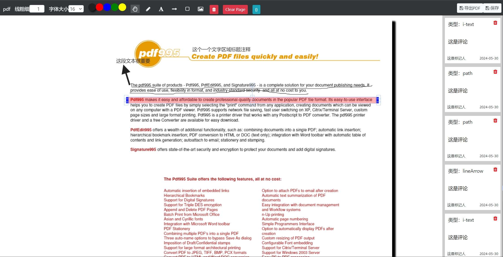

### PDF注释

功能有：pdf在线批注 | 画笔 | 添加文字 | 添加矩形 | 添加圆形  |  保存批注 | 下载等功能

> 目前功能较简单，欢迎大家PR进行功能补充和完善

#### 支持两种方式使用：

- Vue

- iframe

#### 目录介绍

1. 如果使用iframe
  
  只需要将public中PDFJsAnnotations放入自己的项目public下，使用iframe引入使用即可
```vue
<iframe
  src="/PDFJsAnnotations/index.html"
  width="100%"
  height="100%"
  frameborder="0"
></iframe>
```

2. 如果使用Vue

> 需要引入以下依赖：
```sh
npm i fabric

# 获取元素目前直接使用的jquery
npm i jquery
```
> 在项目根目录的index.html中加入如下：
```javascript
<script src="/pdf.min.js"></script>
<script>
  pdfjsLib.GlobalWorkerOptions.workerSrc = "/pdf.worker.min.js";
</script>
```

#### 界面展示


#### 欢迎交流

